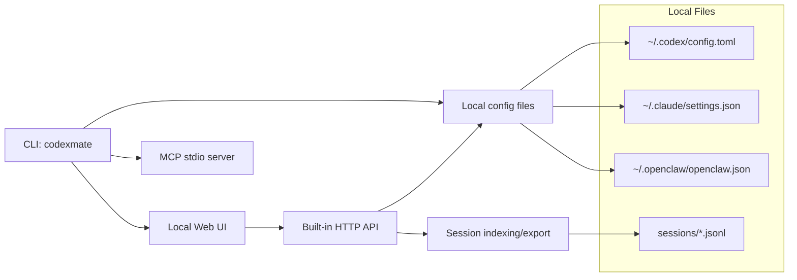

<div align="center">

# Codex Mate

**Local configuration and session manager for Codex / Claude Code / OpenClaw**

> Current version: `v0.0.15`

[](https://github.com/SakuraByteCore/codexmate/actions/workflows/release.yml)
[](https://www.npmjs.com/package/codexmate)
[](https://www.npmjs.com/package/codexmate)
[](LICENSE)
[](https://nodejs.org)

[Quick Start](#quick-start) · [Commands](#command-reference) · [Web UI](#web-ui) · [MCP](#mcp) · [中文](README.md)

</div>

---

## What Is This?

Codex Mate is a local-first CLI + Web UI for unified management of:

- Codex provider/model switching and config writes
- Claude Code profiles (writes to `~/.claude/settings.json`)
- OpenClaw JSON5 profiles and workspace `AGENTS.md`
- Local Codex/Claude sessions (list/filter/export/delete)
- `codexmate qwen` passthrough command

It works on local files directly and does not require cloud hosting.

## Why Codex Mate?

| Dimension | Codex Mate | Manual File Editing |
| --- | --- | --- |
| Multi-tool management | Codex + Claude Code + OpenClaw in one entry | Different files and folders per tool |
| Operation mode | CLI + local Web UI | Manual TOML/JSON/JSON5 edits |
| Session handling | Browse/export/batch cleanup | Manual file location and processing |
| Rollback readiness | Backup before first takeover | Easy to overwrite by mistake |
| Automation integration | MCP stdio (read-only by default) | Requires custom scripting |

## Core Features

**Configuration**
- Provider/model switching (`switch`, `use`)
- Codex `config.toml` template confirmation before write
- Claude Code profile management and apply
- OpenClaw JSON5 profile management

**Session Management**
- Unified Codex + Claude session list
- Keyword/source/cwd filters
- Markdown export
- Session-level and message-level delete (supports batch)

**Engineering Utilities**
- MCP stdio domains (`tools`, `resources`, `prompts`)
- Built-in proxy controls (`proxy`)
- Auth profile management (`auth`)
- `codexmate qwen` compatibility entrypoint (passthrough with `--yolo`)
- Zip/unzip utilities

## Architecture



## Quick Start

### Install from npm

```bash
npm install -g codexmate
codexmate setup
codexmate status
codexmate run
```

Default listen address is `127.0.0.1:3737`, and browser auto-open is enabled by default.

### Run from source

```bash
git clone https://github.com/SakuraByteCore/codexmate.git
cd codexmate
npm install
npm link
codexmate run
```

### Tests / CI (service only)

```bash
codexmate run --no-browser
```

> Convention: automated tests validate service and API behavior only, without opening browser pages.

## Command Reference

| Command | Description |
| --- | --- |
| `codexmate status` | Show current config status |
| `codexmate setup` | Interactive setup |
| `codexmate list` / `codexmate models` | List providers / models |
| `codexmate switch <provider>` / `codexmate use <model>` | Switch provider / model |
| `codexmate add <name> <URL> [API_KEY]` | Add provider |
| `codexmate delete <name>` | Delete provider |
| `codexmate claude <BaseURL> <API_KEY> [model]` | Write Claude Code config |
| `codexmate auth <list\|import\|switch\|delete\|status>` | Auth profile management |
| `codexmate proxy <status\|set\|apply\|enable\|start\|stop>` | Built-in proxy management |
| `codexmate workflow <list\|get\|validate\|run\|runs>` | MCP workflow management |
| `codexmate qwen [args...]` | Qwen CLI passthrough entrypoint |
| `codexmate run [--host <HOST>] [--no-browser]` | Start Web UI |
| `codexmate mcp serve [--read-only\|--allow-write]` | Start MCP stdio server |
| `codexmate export-session --source <codex\|claude> ...` | Export session to Markdown |
| `codexmate zip <path> [--max:0-9]` / `codexmate unzip <zip> [out]` | Zip / unzip |

## Web UI

### Codex Mode
- Provider/model switching
- Model list management
- `~/.codex/AGENTS.md` editing
- `~/.codex/skills` management (filter, batch delete, cross-app import)


### Claude Code Mode
- Multi-profile management
- Default write to `~/.claude/settings.json`
- Shareable import command copy

### OpenClaw Mode
- JSON5 multi-profile management
- Apply to `~/.openclaw/openclaw.json`
- Manage `~/.openclaw/workspace/AGENTS.md`

### Sessions Mode
- Unified Codex + Claude sessions
- Search, filter, export, delete, batch cleanup

## MCP

> Transport: `stdio`

- Default: read-only tools
- Enable writes: `--allow-write` or `CODEXMATE_MCP_ALLOW_WRITE=1`
- Domains: `tools`, `resources`, `prompts`

Examples:

```bash
codexmate mcp serve --read-only
codexmate mcp serve --allow-write
```

## Config Files

- `~/.codex/config.toml`
- `~/.codex/auth.json`
- `~/.codex/models.json`
- `~/.codex/provider-current-models.json`
- `~/.claude/settings.json`
- `~/.openclaw/openclaw.json`
- `~/.openclaw/workspace/AGENTS.md`

## Environment Variables

| Variable | Default | Description |
| --- | --- | --- |
| `CODEXMATE_PORT` | `3737` | Web server port |
| `CODEXMATE_HOST` | `127.0.0.1` | Web listen host |
| `CODEXMATE_NO_BROWSER` | unset | Set `1` to disable browser auto-open |
| `CODEXMATE_MCP_ALLOW_WRITE` | unset | Set `1` to allow MCP write tools by default |
| `CODEXMATE_FORCE_RESET_EXISTING_CONFIG` | `0` | Set `1` to force bootstrap reset of existing config |

## Tech Stack

- Node.js
- Vue.js 3 (Web UI)
- Native HTTP server
- `@iarna/toml`, `json5`

## Contributing

Issues and pull requests are welcome.

- English changelog: `doc/CHANGELOG.md`
- Chinese changelog: `doc/CHANGELOG.zh-CN.md`

## License

Apache-2.0
