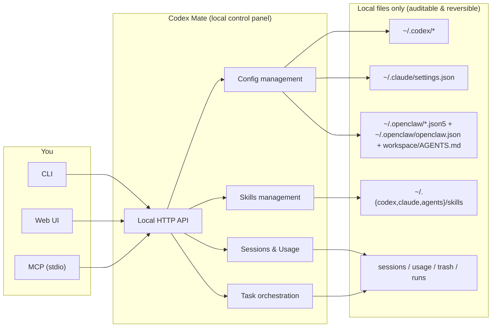

<div align="center">


# Codex Mate

**Local configuration and session manager for Codex / Claude Code / OpenClaw**

[](https://github.com/SakuraByteCore/codexmate/actions/workflows/release.yml)
[](https://www.npmjs.com/package/codexmate)
[](https://www.npmjs.com/package/codexmate)
[](LICENSE)
[](https://nodejs.org/)

[Quick Start](#quick-start) · [Commands](#command-reference) · [Web UI](#web-ui) · [MCP](#mcp) · [中文](README.md)

</div>

---

## What Is This?

Codex Mate is a local-first CLI + Web UI for unified management of:

- Codex provider/model switching and config writes
- Claude Code profiles (writes to `~/.claude/settings.json`)
- OpenClaw JSON5 profiles and workspace `AGENTS.md`
- Local skills market for Codex / Claude Code (target switching, local skills management, cross-app import, ZIP distribution)
- Local Codex/Claude sessions (list/filter/export/delete) with Usage analytics overview

It works on local files directly and does not require cloud hosting. The skills market is also local-first: it operates on local directories and does not depend on a remote marketplace.

## Comparison

| Dimension | Codex Mate | Manual File Editing |
| --- | --- | --- |
| Multi-tool management | Codex + Claude Code + OpenClaw in one entry | Different files and folders per tool |
| Operation mode | CLI + local Web UI | Manual TOML/JSON/JSON5 edits |
| Session handling | Browse/filter/Usage analytics/export/batch cleanup | Manual file location and processing |
| Skills reuse | Local skills market + cross-app import + ZIP distribution | Manual folder copy and reconciliation |
| Operational visibility | Unified view of config, sessions, and Usage summaries | Depends on manual file inspection and scattered commands |
| Rollback readiness | Backup before first takeover | Easy to overwrite by mistake |
| Automation integration | MCP stdio (read-only by default) | Requires custom scripting |

## Core Features

**Configuration**
- Provider/model switching (`switch`, `use`)
- Codex `config.toml` template confirmation before write
- Claude Code profile management and apply
- OpenClaw JSON5 profile management

**Session Management**
- Unified Codex + Claude session list
- Local session pinning with persistent pinned state and pinned-first ordering
- Keyword/source/cwd filters
- Usage subview with 7d / 30d session trends, message trends, source share, and top paths
- Markdown export
- Session-level and message-level delete (supports batch)

**Skills Market**
- Switch the skills install target between Codex and Claude Code
- Inspect local installed skills, root paths, and status
- Scan importable sources from `Codex` / `Claude Code` / `Agents`
- Support cross-app import, ZIP import/export, and batch delete

**Engineering Utilities**
- MCP stdio domains (`tools`, `resources`, `prompts`)
- Built-in proxy controls (`proxy`)
- Auth profile management (`auth`)
- Zip/unzip utilities

## Architecture

### At a glance (what it does → what you get)



### Capability → Local target → Outcome

| Capability | Local target | What you get |
| --- | --- | --- |
| Config management (Codex / Claude / OpenClaw) | `~/.codex/*`, `~/.claude/settings.json`, `~/.openclaw/*` | Faster provider/model switching, multi-profile management, safer writes with backups |
| Sessions & Usage | sessions / usage aggregates / trash | Quickly locate sessions, filter/export, batch cleanup, and view trends |
| Skills market | `~/.{codex,claude,agents}/skills` | Local install/import/export (ZIP), cross-app reuse |
| Task orchestration (plan → run/queue) | local runs / logs | Preview plan before execution, replay logs, retry/cancel |
| MCP (stdio) | local API + file operations | Integrate with external tools under controllable permissions (read-only by default) |

## Quick Start

### Install from npm

```bash
npm install -g codexmate
codexmate setup
codexmate status
codexmate run
```

Default listen address is `0.0.0.0:3737` for LAN access, and browser auto-open is enabled by default.

> Safety note: the unauthenticated management UI is exposed to your current LAN by default. Use trusted networks only; for local-only access, set `CODEXMATE_HOST=127.0.0.1` or pass `--host 127.0.0.1`.

### Run from source

```bash
git clone https://github.com/SakuraByteCore/codexmate.git
cd codexmate
npm install
npm start run
```

### Tests / CI (service only)

```bash
npm start run --no-browser
```

> Convention: automated tests validate service and API behavior only, without opening browser pages.

### Developer helper scripts

```bash
npm run reset
npm run reset 79
```

- `npm run reset`: prompt for a PR number; leave it blank to return to default `origin/main`
- `npm run reset 79`: sync directly to the latest head snapshot of PR `#79`
- The script also handles local branch switching, workspace cleanup, untracked file cleanup, and final state validation

## Command Reference

| Command | Description |
| --- | --- |
| `codexmate status` | Show current config status |
| `codexmate setup` | Interactive setup |
| `codexmate list` / `codexmate models` | List providers / models |
| `codexmate switch <provider>` / `codexmate use <model>` | Switch provider / model |
| `codexmate add <name> <URL> [API_KEY]` | Add provider |
| `codexmate delete <name>` | Delete provider |
| `codexmate claude <BaseURL> <API_KEY> [model]` | Write Claude Code config |
| `codexmate auth <list\|import\|switch\|delete\|status>` | Auth profile management |
| `codexmate proxy <status\|set\|apply\|enable\|start\|stop>` | Built-in proxy management |
| `codexmate workflow <list\|get\|validate\|run\|runs>` | MCP workflow management |
| `codexmate codex [args...] [--follow-up <text> repeatable]` | Codex CLI passthrough entrypoint (auto-adds `--yolo`, supports queued follow-up appends) |
| `codexmate qwen [args...]` | Qwen CLI passthrough entrypoint |
| `codexmate run [--host <HOST>] [--no-browser]` | Start Web UI |
| `codexmate mcp serve [--read-only\|--allow-write]` | Start MCP stdio server |
| `codexmate export-session --source <codex\|claude> ...` | Export session to Markdown |
| `codexmate zip <path> [--max:0-9]` / `codexmate unzip <zip> [out]` | Zip / unzip |
| `codexmate unzip-ext <zip-dir> [out] [--ext:suffix[,suffix...]] [--no-recursive]` | Extract files with target suffixes from ZIP files in a directory (default `.json`, recursive by default) |

### Codex Follow-up Append (Optional)

```bash
codexmate codex --follow-up "scan repository first" --follow-up "then fix failing tests"
codexmate codex --model gpt-5.3-codex --follow-up "step1" --follow-up "step2"
```

> Note: both `--follow-up` and `--queued-follow-up` are accepted and repeatable.

## Web UI

### Codex Mode
- Provider/model switching
- Model list management
- `~/.codex/AGENTS.md` editing

### Claude Code Mode
- Multi-profile management
- Default write to `~/.claude/settings.json`
- Shareable import command copy

### OpenClaw Mode
- JSON5 multi-profile management
- Apply to `~/.openclaw/openclaw.json`
- Manage `~/.openclaw/workspace/AGENTS.md`

### Sessions Mode
- Unified Codex + Claude sessions
- Browser / Usage subview switching
- Local pin/unpin with persistent storage and pinned-first ordering
- Search, filter, export, delete, batch cleanup
- Usage view includes 7d / 30d session trends, message trends, source share, and top paths

### Skills Market Tab
- Switch the skills install target between `Codex` and `Claude Code`
- Show the current local skills root, installed items, and importable items
- Scan importable sources under `Codex` / `Claude Code` / `Agents`
- Support cross-app import, ZIP import/export, and batch delete

## MCP

> Transport: `stdio`

- Default: read-only tools
- Enable writes: `--allow-write` or `CODEXMATE_MCP_ALLOW_WRITE=1`
- Domains: `tools`, `resources`, `prompts`

Examples:

```bash
codexmate mcp serve --read-only
codexmate mcp serve --allow-write
```

## Config Files

- `~/.codex/config.toml`
- `~/.codex/auth.json`
- `~/.codex/models.json`
- `~/.codex/provider-current-models.json`
- `~/.claude/settings.json`
- `~/.openclaw/openclaw.json`
- `~/.openclaw/workspace/AGENTS.md`

## Environment Variables

| Variable | Default | Description |
| --- | --- | --- |
| `CODEXMATE_PORT` | `3737` | Web server port |
| `CODEXMATE_HOST` | `0.0.0.0` | Web listen host (set `127.0.0.1` for local-only access) |
| `CODEXMATE_NO_BROWSER` | unset | Set `1` to disable browser auto-open |
| `CODEXMATE_MCP_ALLOW_WRITE` | unset | Set `1` to allow MCP write tools by default |
| `CODEXMATE_FORCE_RESET_EXISTING_CONFIG` | `0` | Set `1` to force bootstrap reset of existing config |

## Tech Stack

- Node.js
- Vue.js 3 (Web UI)
- Native HTTP server
- `@iarna/toml`, `json5`

## Contributing

Issues and pull requests are accepted.

## License

Apache-2.0

### Claude Code Mode
- Multi-profile management
- Default write to `~/.claude/settings.json`
- Shareable import command copy

### OpenClaw Mode
- JSON5 multi-profile management
- Apply to `~/.openclaw/openclaw.json`
- Manage `~/.openclaw/workspace/AGENTS.md`

### Sessions Mode
- Unified Codex + Claude sessions
- Browser / Usage subview switching
- Local pin/unpin with persistent storage and pinned-first ordering
- Search, filter, export, delete, batch cleanup
- Usage view includes 7d / 30d session trends, message trends, source share, and top paths

### Skills Market Tab
- Switch the skills install target between `Codex` and `Claude Code`
- Show the current local skills root, installed items, and importable items
- Scan importable sources under `Codex` / `Claude Code` / `Agents`
- Support cross-app import, ZIP import/export, and batch delete

## MCP

> Transport: `stdio`

- Default: read-only tools
- Enable writes: `--allow-write` or `CODEXMATE_MCP_ALLOW_WRITE=1`
- Domains: `tools`, `resources`, `prompts`

Examples:

```bash
codexmate mcp serve --read-only
codexmate mcp serve --allow-write
```

## Config Files

- `~/.codex/config.toml`
- `~/.codex/auth.json`
- `~/.codex/models.json`
- `~/.codex/provider-current-models.json`
- `~/.claude/settings.json`
- `~/.openclaw/openclaw.json`
- `~/.openclaw/workspace/AGENTS.md`

## Environment Variables

| Variable | Default | Description |
| --- | --- | --- |
| `CODEXMATE_PORT` | `3737` | Web server port |
| `CODEXMATE_HOST` | `0.0.0.0` | Web listen host (set `127.0.0.1` for local-only access) |
| `CODEXMATE_NO_BROWSER` | unset | Set `1` to disable browser auto-open |
| `CODEXMATE_MCP_ALLOW_WRITE` | unset | Set `1` to allow MCP write tools by default |
| `CODEXMATE_FORCE_RESET_EXISTING_CONFIG` | `0` | Set `1` to force bootstrap reset of existing config |

## Tech Stack

- Node.js
- Vue.js 3 (Web UI)
- Native HTTP server
- `@iarna/toml`, `json5`

## Contributing

Issues and pull requests are accepted.

## License

Apache-2.0
