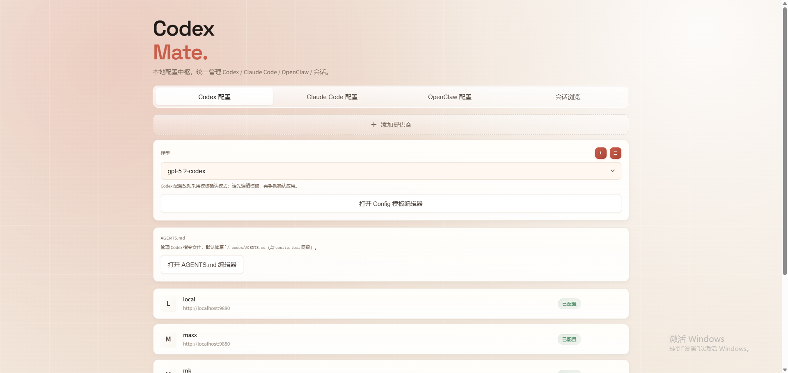

# Codex Mate

<div align="center">


[](https://github.com/ymkiux/codexmate/actions/workflows/release.yml)
[](https://www.npmjs.com/package/codexmate)
[](https://www.npmjs.com/package/codexmate)
[](https://github.com/ymkiux/codexmate)
[](https://github.com/ymkiux/codexmate/commits)
[](LICENSE)
[](https://nodejs.org)

**A lightweight AI configuration assistant: quickly switch Codex providers/models and Claude Code configs, with a unified session browser**

</div>

---

<p align="center">English · <a href="README.zh-CN.md">中文版</a></p>



## Overview

One tool to switch Codex/Claude Code providers & models and manage/browse local sessions in one click.

## What You Get

- One-command provider/model switching
- Local config control with backups
- Lightweight Web UI instead of heavy clients
- Unified session browser (view/export/resume when available)
- Session management: list/filter/export/delete local sessions; keyword search supports Codex and Claude
- New in 0.0.10: Claude sessions are searchable by keywords (e.g., `claude code`, `claude-code`, numeric tokens)

## Feature Overview

| Module | Problem | Key Capabilities |
| --- | --- | --- |
| Codex Config | Switching providers/models is painful | Provider/model switching, model management, CLI + Web entry points, template-confirmed writes |
| Skills Manager | Local custom skills are hard to inspect and clean up | Skills modal with overview counters, keyword/status filters, bulk delete, and cross-app import scan |
| Claude Code Config | Multiple profiles and inconsistent write paths | Profile management, default write to `~/.claude/settings.json` |
| OpenClaw Config | OpenClaw configs are scattered | JSON5 profiles, apply to `~/.openclaw/openclaw.json`, AGENTS workspace management |
| Session Browser | Local sessions are hard to track | List/filter sessions, keyword search (Codex + Claude), export to Markdown, copy resume command (when available), delete and batch cleanup |
| Utilities | Compression/extraction requires extra tools | 7-Zip preferred, JS fallback |

## Why Codex Mate

- Focused on three jobs: Codex provider/model switching + Claude Code config apply + OpenClaw config apply
- Local-first: configs and API keys are written to local files, not the cloud
- Lightweight: CLI + Web, no desktop app required
- Reversible: auto-backup before first takeover

## Use Cases

- Frequent provider/model switching, want a one-command flow
- Use both Codex and Claude Code, want a single entry point
- Need to browse/export local Codex + Claude Code sessions and copy resume commands when available
- Use OpenClaw with multiple profiles, want quick switching
- Multi-project or multi-environment setups that need quick config changes
- Want a visual UI without a heavy client

## Scope and Boundaries

- Only configuration management for Codex, Claude Code, and OpenClaw, not a full all-in-one tool suite
- No built-in proxy/relay/billing dashboard/cloud sync (kept lightweight)
- Web UI runs only when you start it (`codexmate run`)

## 30-Second Start (No Install)

```bash
npx codexmate@latest status
```

```bash
npx codexmate@latest run
```

Then open `http://localhost:3737` in your browser.

## Quick Start

1. Install (global):
```bash
npm install -g codexmate
```

Or run once without install:
```bash
npx codexmate@latest status
```

2. Run the interactive setup:
```bash
codexmate setup
```

3. Check status:
```bash
codexmate status
```

4. Start the Web UI:
```bash
codexmate run
```

Then open `http://localhost:3737` in your browser.

## Alternatives

- cc-switch: https://github.com/farion1231/cc-switch

## Install

### Global (Recommended)

```bash
npm install -g codexmate
```

Package name on npm: `codexmate`.

Want to update to the latest effects features each time? Install from GitHub (re-run to update):

```bash
npm install -g ymkiux/codexmate
```

### Run with npx (No Install)

```bash
npx codexmate@latest status
```

```bash
npx codexmate@latest run
```

### From Source

```bash
git clone https://github.com/ymkiux/codexmate.git
cd codexmate
npm install
npm link
```

### Requirements

- Node.js >= 14
- Windows / macOS / Linux

## CLI Cheat Sheet

| Command | Description |
| --- | --- |
| `codexmate` | Show help and available commands |
| `codexmate setup` | Interactive configuration wizard |
| `codexmate status` | Show current status |
| `codexmate list` | List all providers |
| `codexmate switch <provider>` | Switch provider |
| `codexmate use <model>` | Switch model |
| `codexmate add <name> <URL> [API key]` | Add a provider |
| `codexmate delete <provider>` | Delete a provider |
| `codexmate claude <BaseURL> <API key> [model]` | Write Claude Code config to `~/.claude/settings.json` |
| `codexmate models` | List all models |
| `codexmate add-model <model>` | Add a model |
| `codexmate delete-model <model>` | Delete a model |
| `codexmate run` | Start the Web UI |
| `codexmate mcp [serve] [--transport stdio] [--allow-write\|--read-only]` | Start MCP server over stdio (default read-only) |
| `codexmate export-session --source <codex|claude> (--session-id <ID>|--file <PATH>) [--output <PATH>] [--max-messages <N|all|Infinity>]` | Export a session to Markdown |

## MCP (stdio)

- Transport: `stdio` only
- Default mode: read-only tool set
- Write tools: enable by `--allow-write` or `CODEXMATE_MCP_ALLOW_WRITE=1`
- Sensitive fields in `codexmate.claude.settings.get` are returned as masked values

```bash
# Read-only (recommended for external agents)
codexmate mcp serve --read-only

# Enable write tools explicitly
codexmate mcp serve --allow-write
```

Provided MCP domains:

- `tools`: status/provider/model/session/auth/proxy and config operations
- `resources`: status/providers/sessions snapshots
- `prompts`: built-in diagnose/switch/export templates

## Web UI

Start the Web UI (auto opens browser):

```bash
codexmate run
```

### Codex Config Mode

- View current provider and model status
- Quickly switch provider and model
- Manage available model list
- Edit `~/.codex/AGENTS.md` instruction file (same level as `config.toml`)
- Open the Skills Manager modal for `~/.codex/skills` (overview counters, keyword/status filters, multi-select delete, cross-app import scan)
- Add/delete custom providers
- Supports Codex config management on Linux/Windows

### Skills Manager Modal

- Shows overview counters (`total`, `with SKILL.md`, `missing SKILL.md`, `importable`) for quick audit
- Supports keyword search by folder name/display name/description and status filter by `SKILL.md` presence
- Supports multi-select and bulk deletion for local skills
- Supports scanning unmanaged skills from other apps and importing selected items in batch

### Claude Code Config Mode (Windows / macOS / Linux)

- Manage multiple Claude Code profiles
- Configure API key, Base URL, and model
- Default write to `env` in `~/.claude/settings.json`: `env.ANTHROPIC_API_KEY` / `env.ANTHROPIC_BASE_URL` / `env.ANTHROPIC_MODEL`
- One-liner apply via CLI:

```bash
codexmate claude https://api.example.com/v1 sk-ant-xxx claude-3-7-sonnet
```

- In the Web UI, each Claude configuration card now has a "Share Import Command" button that copies a one-click import command (for example: `codexmate claude <BaseURL> <API Key> <Model>`).

### OpenClaw Config Mode

- Manage multiple OpenClaw JSON5 profiles
- Apply to `~/.openclaw/openclaw.json`
- Manage `AGENTS.md` under the OpenClaw Workspace (default: `~/.openclaw/workspace/AGENTS.md`)

### Session Browser

- View local Codex and Claude Code sessions in one page
- Filter by source (Codex / Claude / All)
- Filter by session path (cwd), auto refresh on selection
- Export selected sessions to Markdown
- Copy resume command when available
- Delete single sessions (local jsonl records)
- Batch delete multiple sessions with partial failure summary
- Delete individual records or multi-select within session details (writes back to original jsonl)

### Codex Template Confirmation Mode

- Codex config changes in Web UI go to a `config.toml` template editor first
- Only writes to `config.toml` after you click "Confirm Apply Template"
- Prevents direct one-click overwrites from the UI

## Configuration Files

Config directory: `~/.codex/`

- `config.toml` - Codex main config
- `auth.json` - API auth info
- `models.json` - Available model list
- `provider-current-models.json` - Per-provider current model config
- `codexmate-init.json` - First-run marker
- `config.toml.codexmate-backup-*.bak` - Backup created on first takeover

Claude Code config files:

- `~/.claude/settings.json` - Runtime config (default write target)
- `~/.claude/settings.json.codexmate-backup-*.bak` - Backup before first overwrite

OpenClaw config files:

- `~/.openclaw/openclaw.json` - OpenClaw config (JSON5)
- `~/.openclaw/workspace/AGENTS.md` - OpenClaw workspace instructions

## First Run Initialization

When you run `codexmate` for the first time and an existing `~/.codex/config.toml` is detected that is not managed by Codex Mate:

- The original file is backed up as `config.toml.codexmate-backup-<timestamp>.bak`
- The original `config.toml` is preserved, and a first-run marker is written
- Only when `CODEXMATE_FORCE_RESET_EXISTING_CONFIG=1` is set will the default config be rebuilt
- Subsequent runs will not repeat this process

## Examples

### Add a Custom API Provider

```bash
codexmate add myapi https://api.example.com/v1 sk-your-api-key
codexmate switch myapi
```

### Switch to a Different Model

```bash
codexmate use gpt-4-turbo
```

### Export a Session (CLI)

```bash
codexmate export-session --source codex --session-id 123456
codexmate export-session --source claude --file "~/.claude/projects/demo/session.jsonl" --max-messages=all
```

By default, exports are capped at 1000 messages. Use `--max-messages=all` (or `Infinity`) to export everything.

### Configure Claude Code (Cross-Platform)

1. Start the Web UI: `codexmate run`
2. Switch to "Claude Code Config" mode in the browser
3. Add a profile (example Zhipu GLM): Name=ZhipuGLM, API Key=your API key, Base URL=`https://open.bigmodel.cn/api/anthropic`, Model=`glm-4.7`
4. Click the card to apply, or use "Save & Apply to Claude Config" in the editor
5. Default write to `~/.claude/settings.json`
6. Restart Claude Code to apply

### Start the Web UI

```bash
codexmate run
```

By default it binds to `127.0.0.1`. To expose on LAN, use `--host` or `CODEXMATE_HOST`:

```bash
codexmate run --host 0.0.0.0
```

Then open `http://localhost:3737` (or your chosen host). Note: binding to `0.0.0.0` is unsafe on untrusted networks.

## FAQ

### Q: Which operating systems are supported?

A: Codex features support Windows and Linux (CLI and Web). Claude Code config applies to Windows / macOS / Linux (writes to `~/.claude/settings.json`).

### Q: Where are API keys stored?

A: API keys are stored locally in `~/.codex/config.toml` and are not uploaded.

### Q: Is the Web UI safe?

A: The Web UI runs locally; all operations happen on your machine. API keys are masked in the UI.

### Q: How do Claude Code configs take effect?

A: After clicking "Apply to Claude Config", it writes to `~/.claude/settings.json`. Restart Claude Code to apply.

### Q: How to uninstall?

A: Run `npm uninstall -g codexmate`.

## Extras: Compression/Extraction

Prefer 7-Zip for multithreaded zip/unzip. Fallback to the built-in JS library when unavailable.

```bash
# Compress file or folder (default compression level 5)
codexmate zip <path>

# Set compression level (0-9, 0=store only, 9=max)
codexmate zip <path> --max:9

# Unzip a zip file (default to same-level folder)
codexmate unzip <zip path>

# Unzip to a specific output directory
codexmate unzip <zip path> <output dir>
```

Examples:

```bash
# Compress a project folder
codexmate zip ./my-project

# Max compression
codexmate zip ./my-project --max:9

# Store only (fast)
codexmate zip ./large-folder --max:0

# Unzip
codexmate unzip ./my-project.zip

# Unzip to a target location
codexmate unzip ./backup.zip D:/restored
```

Note: 7-Zip is optional. If missing, the built-in JS library is used. `--max` only applies to 7-Zip.

## Tech Stack

- **Node.js** - Runtime
- **@iarna/toml** - TOML parser
- **Vue.js 3** - Web UI framework
- **Native HTTP** - Built-in Web server

## Release (GitHub Actions)

Create a tag that matches `package.json` (for example `v0.0.9`). Then run the `release` workflow in GitHub Actions and input that tag. It will create a GitHub Release and attach the `npm pack` `.tgz` artifact.

## License

Apache-2.0 © [ymkiux](https://github.com/ymkiux)

## Contributing

Issues and pull requests are welcome.

## Changelog

See [doc/CHANGELOG.md](doc/CHANGELOG.md) for the English version.
See [doc/CHANGELOG.zh-CN.md](doc/CHANGELOG.zh-CN.md) for the Chinese version.

---

Made with [ymkiux](https://github.com/ymkiux)
