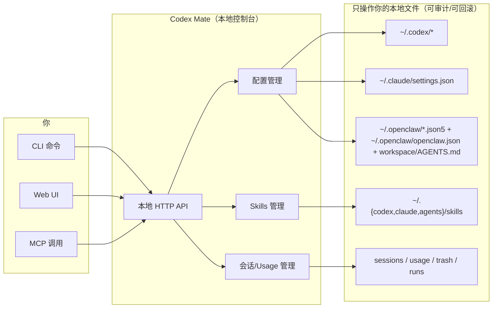

<div align="center">


# Codex Mate

**Codex / Claude Code / OpenClaw 的本地配置与会话管理工具**

[](https://github.com/SakuraByteCore/codexmate/actions/workflows/release.yml)
[](https://www.npmjs.com/package/codexmate)
[](https://www.npmjs.com/package/codexmate)
[](LICENSE)
[](https://nodejs.org/)

[快速开始](#快速开始) · [命令速查](#命令速查) · [Web 界面](#web-界面) · [MCP](#mcp) · [English](README.en.md)

</div>

---

## 这是什么？

Codex Mate 提供一套本地优先的 CLI + Web UI，用于统一管理：

- Codex 的 provider / model 切换与配置写入
- Claude Code 配置方案（写入 `~/.claude/settings.json`）
- OpenClaw JSON5 配置与 Workspace `AGENTS.md`
- Codex / Claude Code Skills 市场（安装目标切换、本地 skills 管理、跨应用导入、ZIP 分发）
- Codex / Claude 本地会话浏览、筛选、导出、删除与 Usage 统计概览
- 任务编排（规划中，未开放）

项目不依赖云端托管，配置写入你的本地文件，便于审计和回滚。Skills 市场同样坚持本地优先，只操作本地目录，不依赖远程在线市场。

## 功能对比

| 维度 | Codex Mate | 手动维护配置 |
| --- | --- | --- |
| 多工具管理 | Codex + Claude Code + OpenClaw 统一入口 | 多文件、多目录分散修改 |
| 使用方式 | CLI + 本地 Web UI | 纯手改 TOML / JSON / JSON5 |
| 会话处理 | 支持浏览、筛选、Usage 统计、导出、批量清理 | 需要手动定位和处理文件 |
| Skills 复用 | 本地 Skills 市场 + 跨应用导入 + ZIP 分发 | 目录手动复制，容易遗漏 |
| 使用可见性 | 统一查看配置、会话、Usage 与运行状态 | 依赖手工翻文件和零散命令 |
| 可回滚性 | 首次接管前自动备份 | 易误覆盖、回滚成本高 |
| 自动化接入 | 提供 MCP stdio（默认只读） | 需自行封装脚本 |

## 核心特性

**配置管理**
- provider / model 切换（`switch` / `use`）
- Codex `config.toml` 模板确认后写入
- Claude Code 多配置方案管理与一键应用
- 分享命令前缀切换（`npm start` / `codexmate`），用于复制 provider / Claude 导入命令，选择持久化到浏览器本地缓存
- OpenClaw JSON5 配置方案管理

**会话管理**
- 同页查看 Codex 与 Claude 会话
- 支持本地会话置顶，置顶状态持久化保存并优先排序显示
- 关键词搜索、来源筛选、cwd 路径筛选
- Usage 子页：近 7 天 / 近 30 天会话趋势、消息趋势、来源占比、高频路径
- 会话导出 Markdown
- 会话与消息级删除（支持批量）

**Skills 市场**
- 在 Codex 与 Claude Code 之间切换 skills 安装目标
- 查看本地已安装 skills、根目录与状态
- 扫描 `Codex` / `Claude Code` / `Agents` 可导入来源
- 支持跨应用导入、ZIP 导入 / 导出、批量删除

**任务编排（规划中，未开放）**
- 当前版本暂未开放，功能与文档可能调整

**工程能力**
- MCP stdio 能力（tools/resources/prompts）
- Zip 压缩/解压（优先系统工具，失败回退 JS 库）

## 架构总览

### 一图看懂（从“做什么”到“产生什么效果”）



### 能力 → 作用对象 → 用户收益（直观对照）

| 能力 | 作用对象（本地） | 你能直接得到什么 |
| --- | --- | --- |
| 配置管理（Codex / Claude / OpenClaw） | `~/.codex/*`、`~/.claude/settings.json`、`~/.openclaw/*` | 一键切换 provider/model、管理多套配置、写入前后可控与可回滚 |
| 会话与 Usage | sessions / usage 聚合 / trash | 更快定位会话、筛选导出、批量清理、查看趋势与占比 |
| Skills 市场 | `~/.{codex,claude,agents}/skills` | 本地安装/导入/导出/分发（ZIP），跨应用复用更省事 |
| MCP（stdio） | 本地 API / 文件能力 | 让外部工具以“可控权限”调用本地能力（默认只读） |

## 快速开始

### npm 全局安装

```bash
npm install -g codexmate
codexmate setup
codexmate status
codexmate run
```

默认监听 `0.0.0.0:3737`，支持局域网访问，并尝试自动打开浏览器。

> 安全提示：默认监听会在当前局域网暴露未鉴权的管理界面。若包含 API Key、provider 配置或 skills 管理，请仅在可信网络中使用；如需仅本机访问，可设置 `CODEXMATE_HOST=127.0.0.1` 或启动时传入 `--host 127.0.0.1`。

### 从源码运行

```bash
git clone https://github.com/SakuraByteCore/codexmate.git
cd codexmate
npm install
npm start run
```

### 测试 / CI（只启动服务）

```bash
npm start run --no-browser
```

> 约定：自动化测试仅验证服务与 API，不依赖打开页面。

### 开发辅助脚本

```bash
npm run reset
npm run reset 79
```

- `npm run reset`：交互输入 PR 编号；留空则回到默认 `origin/main`
- `npm run reset 79`：直接同步到 PR `#79` 的最新 head 快照
- 脚本会自动完成本地分支切换、工作区清理、未跟踪文件清理与最终状态校验

## 命令速查

| 命令 | 说明 |
| --- | --- |
| `codexmate status` | 查看当前配置状态 |
| `codexmate setup` | 交互式初始化 |
| `codexmate list` / `codexmate models` | 查看提供商 / 模型 |
| `codexmate switch <provider>` / `codexmate use <model>` | 切换 provider / model |
| `codexmate add <name> <URL> [API_KEY]` | 添加提供商 |
| `codexmate delete <name>` | 删除提供商 |
| `codexmate claude <BaseURL> <API_KEY> [model]` | 写入 Claude Code 配置 |
| `codexmate workflow <list\|get\|validate\|run\|runs>` | MCP 工作流管理 |
| `codexmate codex [args...] [--follow-up <文本> 可重复]` | Codex CLI 透传入口（默认补 `--yolo`，可追加 queued follow-up） |
| `codexmate qwen [args...]` | Qwen CLI 透传入口 |
| `codexmate run [--host <HOST>] [--no-browser]` | 启动 Web UI |
| `codexmate mcp serve [--read-only\|--allow-write]` | 启动 MCP stdio 服务 |
| `codexmate export-session --source <codex\|claude> ...` | 导出会话为 Markdown |
| `codexmate zip <path> [--max:0-9]` / `codexmate unzip <zip> [out]` | 压缩 / 解压 |
| `codexmate unzip-ext <zip-dir> [out] [--ext:suffix[,suffix...]] [--no-recursive]` | 批量提取目录下 ZIP 内指定后缀文件（默认 `.json`，默认递归） |

### Codex follow-up 追加（可选）

```bash
codexmate codex --follow-up "先扫描项目" --follow-up "再修复失败测试"
codexmate codex --model gpt-5.3-codex --follow-up "步骤1" --follow-up "步骤2"
```

> 说明：`--follow-up` / `--queued-follow-up` 都可用，支持重复。

## Web 界面

### Codex 配置模式
- provider / model 切换
- 模型管理
- `~/.codex/AGENTS.md` 编辑

### Claude Code 配置模式
- 多配置方案管理
- 默认写入 `~/.claude/settings.json`
- 支持复制分享导入命令

### OpenClaw 配置模式
- JSON5 多方案管理
- 应用到 `~/.openclaw/openclaw.json`
- 管理 `~/.openclaw/workspace/AGENTS.md`

### 会话模式
- Codex + Claude 会话统一列表
- Browser / Usage 双子视图切换
- 支持本地会话置顶、持久化保存与置顶优先排序
- 搜索、筛选、导出、删除、批量清理
- Usage 视图提供近 7 天 / 近 30 天会话趋势、消息趋势、来源占比与高频路径统计
- 费用估算当前只统计可识别模型单价的非 Claude 会话

### Skills 市场标签页
- 在 `Codex` 与 `Claude Code` 之间切换 skills 安装目标
- 展示当前目标的本地 skills 根目录、已安装项和可导入项
- 扫描 `Codex` / `Claude Code` / `Agents` 目录中的可导入来源
- 支持跨应用导入、ZIP 导入 / 导出、批量删除

### 设置标签页
- 支持切换分享命令前缀：`npm start` / `codexmate`
- 影响 Web UI 中复制出来的 provider 分享命令与 Claude 导入命令
- 选择持久化到浏览器本地缓存，刷新页面后仍保留

## MCP

> 传输：`stdio`

- 传输：仅 `stdio`
- 默认：只读工具集
- 写入开启：`--allow-write` 或 `CODEXMATE_MCP_ALLOW_WRITE=1`
- 包含域：`tools`、`resources`、`prompts`

示例：

```bash
codexmate mcp serve --read-only
codexmate mcp serve --allow-write
```

## 配置文件

- `~/.codex/config.toml`
- `~/.codex/auth.json`
- `~/.codex/models.json`
- `~/.codex/provider-current-models.json`
- `~/.claude/settings.json`
- `~/.openclaw/openclaw.json`
- `~/.openclaw/workspace/AGENTS.md`

## 环境变量

| 变量 | 默认值 | 说明 |
| --- | --- | --- |
| `CODEXMATE_PORT` | `3737` | Web 服务端口 |
| `CODEXMATE_HOST` | `0.0.0.0` | Web 服务监听地址（如需仅本机访问，显式设为 `127.0.0.1`） |
| `CODEXMATE_NO_BROWSER` | 未设置 | 设为 `1` 后不自动打开浏览器 |
| `CODEXMATE_MCP_ALLOW_WRITE` | 未设置 | 设为 `1` 后默认允许 MCP 写工具 |
| `CODEXMATE_FORCE_RESET_EXISTING_CONFIG` | `0` | 设为 `1` 时首次可强制重建托管配置 |

## 技术栈

- Node.js
- Vue.js 3（Web UI）
- 原生 HTTP Server
- `@iarna/toml`、`json5`

## 参与贡献

Issue 与 Pull Request 可按需提交。

## License

Apache-2.0
